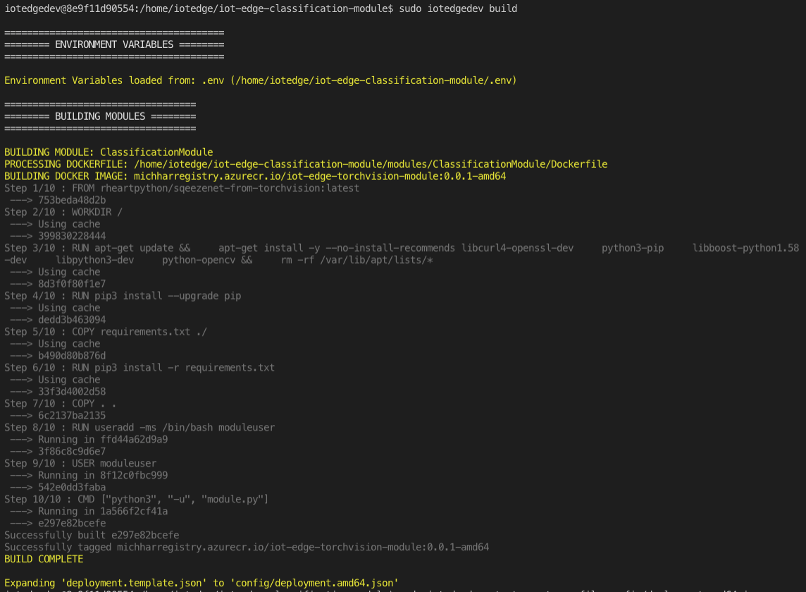
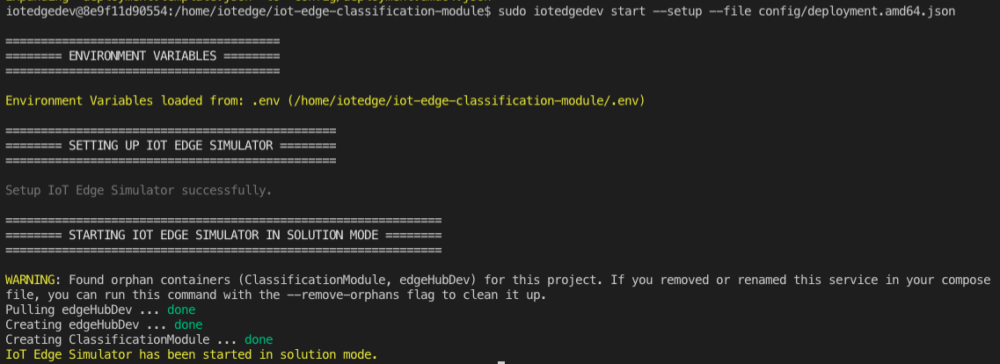
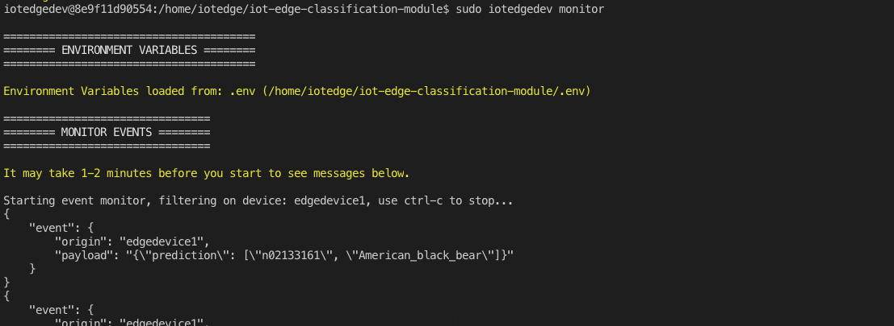

Azure IoT Edge Classification Module
----

This uses a PyTorch Squeezenet model for image classification encapsulated in an Azure IoT Edge module for running on Edge Devices or in the Simulator.

## Prerequisites

1.  Docker (Community Edition) for Mac or Windows
2.  Visual Studio Code (VSCode) text editor with IoT Edge extension (to get this go to View -> Extensions and type in "IoT Edge", select "Azure IoT Edge") - alternatively all of the work may be done on the command line as is shown in [this tutorial](https://docs.microsoft.com/en-us/azure/iot-edge/quickstart-linux).
3.  Azure IoT Hub resource in the Azure Cloud
4.  Azure IoT Edge Device in said Hub
5.  Set up the <a href="https://github.com/Azure/iotedgedev" target="_blank">Azure IoT Edge Dev Tool</a> which provides a simulation environment for IoT Edge Modules

## Instructions

Follow the Quickstart at <a href="https://github.com/Azure/iotedgedev" target="_blank">https://github.com/Azure/iotedgedev</a>.  See the Wiki for more information and instructions.

Building the module with the simulator tool, `iotedgedev`, will produce output like:

The next step (combined command to setup and start simulator) will produce output like:

The final step, monitoring the simulated module, will produce output like:

## Contribute

Issues and Pull Requests are welcome.

## Troubleshooting

If you need a `.env` file in the running docker container created above, it will help to have an editor like `vim`.  Install into the container with:

    sudo apt-get update && sudo apt-get install vim
    sudo vim .env

Then to add the system variables listed in the `.env` just "source" it in Unix environments:

    source .env

To check the logs of a particular container (e.g. the IoT Edge Module) run:

    sudo docker logs <CONTAINER ID>

## Additional Notes

* Using https://download.pytorch.org/models/squeezenet1_1-f364aa15.pth (click will download) Squeezenet model
